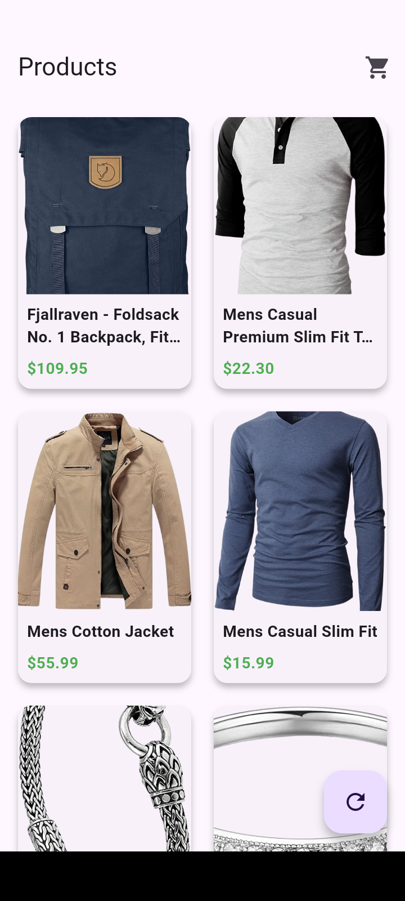
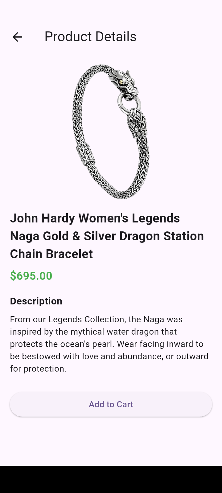
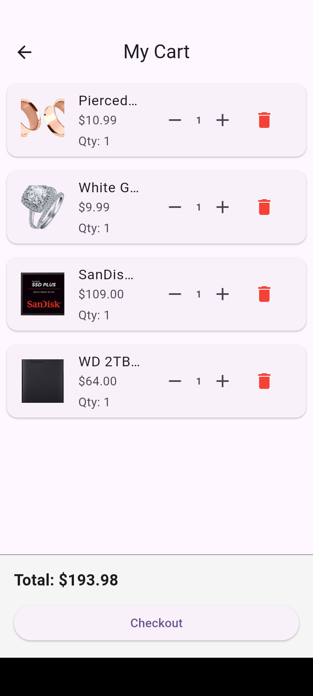

# 🛒 Flutter E-Commerce App

A modern **Flutter E-Commerce application** built using **Clean Architecture** and **BLoC state management**.  
This project demonstrates best practices for **scalable Flutter app development** and is designed as a **portfolio project for a fresher Flutter developer**.

---

## ✨ Features

- Product listing using REST API (Fake Store API)
- Product details page with image, title, price, and description
- Add to cart functionality
- Increase / decrease product quantity in cart
- Remove item from cart
- Cart badge with total item count
- Total price calculation
- Cart persistence using Hive (local storage)
- Empty cart state with user-friendly UI
- Error handling for API & images
- Clean and responsive UI

---

## 🧱 Architecture

The project follows **Clean Architecture** principles:


lib/
├── core/
├── features/
│ ├── products/
│ │ ├── data/
│ │ ├── domain/
│ │ └── presentation/
│ ├── cart/
│ ├── data/
│ ├── domain/
│ └── presentation/

### Layers

- **Data Layer** → Handles API calls and local storage (Hive)
- **Domain Layer** → Contains entities and business logic
- **Presentation Layer** → UI screens and BLoC state management

---

## 🔧 Tech Stack

- Flutter
- Dart
- BLoC (flutter_bloc)
- REST API (Fake Store API)
- Hive (local persistence)
- Clean Architecture
- Git & GitHub

---

## 🌐 API Used

- Fake Store API  
https://fakestoreapi.com/products


---

## 🚀 Getting Started

### 1️⃣ Clone the repository
```bash
git clone https://github.com/Chorusraj/E-commerce

2️⃣ Install dependencies
flutter pub get

3️⃣ Run the app
flutter run


## 📸 Screenshots

### Product List


### Product Details


### Cart Page


### Cart Empty Page


👨‍💻 Author

Chorus Rajbanshi
Flutter Developer (Fresher)

GitHub: https://github.com/Chorusraj

LinkedIn: https://www.linkedin.com/in/chorus-rajbanshi-32ba7a330/